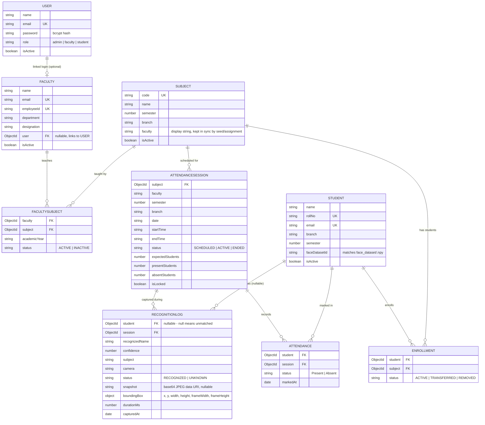

# FACREC — Entity Relationship Diagram

## Uniqueness constraints (duplicate prevention)

| Model | Constraint |
|---|---|
| `User.email` | unique |
| `Student.rollNo`, `Student.email` | unique |
| `Faculty.email`, `Faculty.employeeId` | unique |
| `Subject.code` | unique |
| `Enrollment` | compound unique on `(student, subject)` — a student can't double-enroll in the same subject |
| `FacultySubject` | compound unique on `(faculty, subject, academicYear)` — same assignment can't be created twice |
| `Attendance` | enforced at the service layer (`attendanceService.markAttendance` checks for an existing Present record for that student+session before inserting) rather than a DB index, so "already marked" can return a friendly message instead of a raw duplicate-key error |

## Why `Enrollment` doesn't duplicate `branch`/`semester`

`Enrollment` only stores `student` and `subject` references plus
`status`. Branch and semester live on `Student` and `Subject`
respectively. Storing them again on `Enrollment` would be denormalized
data that silently goes stale if a student changes branch — populate
`student`/`subject` when that info is needed instead.
