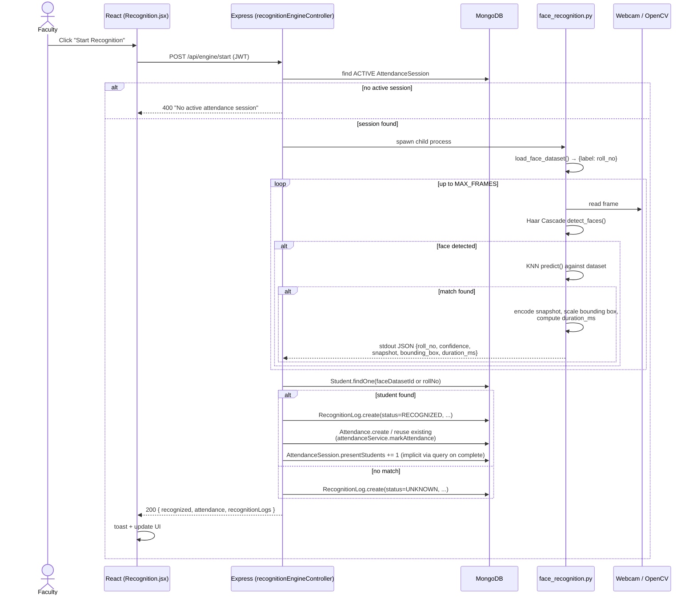
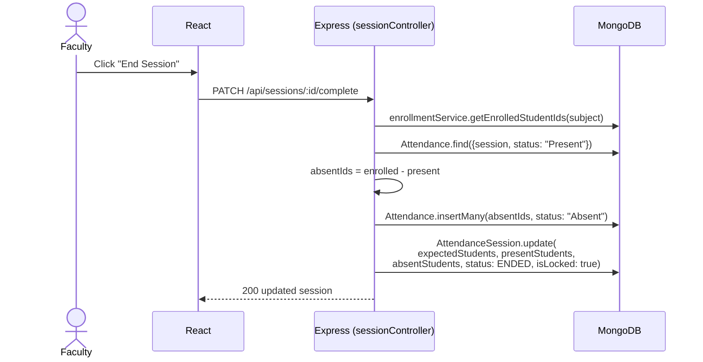

# FACREC — Sequence Diagram: Recognition → Attendance

This is the core workflow examiners tend to ask about. Mermaid renders
this natively on GitHub; if viewing elsewhere, paste it into
https://mermaid.live.

## Session completion (auto-absent detection)

